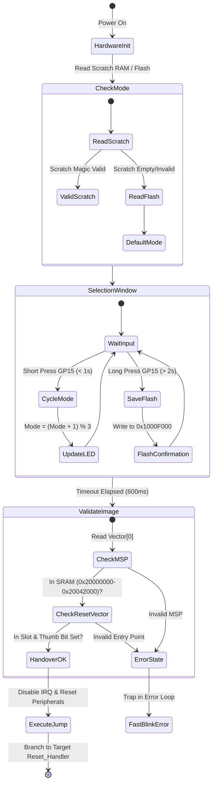

# System Architecture & Technical Specifications

This document describes the internal software architecture, flash partitioning, and CPU handover mechanism of the **Pico Universal Programmer**.

---

## 1. Flash Partitioning Map

The RP2040 provides 2,048 KB (2 MB) of external QSPI flash mapped at `0x10000000`.

```
0x10000000 +-------------------------------------------------------+
           | Slot 0: Multi-Boot Supervisor (60 KB)                 |
0x1000F000 +-------------------------------------------------------+
           | Slot Config: Persistent Settings Sector (4 KB)        |
0x10010000 +-------------------------------------------------------+
           | Slot 1: Raspberry Pi Debug Probe (CMSIS-DAP) (512 KB) |
0x10090000 +-------------------------------------------------------+
           | Slot 2: Black Magic Probe (512 KB)                    |
0x10110000 +-------------------------------------------------------+
           | Slot 3: PicoRVD (CH32V003 1-Wire) (512 KB)            |
0x10190000 +-------------------------------------------------------+
           | Reserved / Expansion Space (448 KB)                   |
0x10200000 +-------------------------------------------------------+
```

---

## 2. Boot & Handover State Machine



---

## 3. CPU Handover Sequence

To prevent peripheral conflicts and memory corruption, the handover from the supervisor to the target firmware follows a strict 5-step sequence:

1. **Disable Interrupts:** `__asm volatile ("cpsid i" : : : "memory");` ensures no pending SysTick or timer interrupt can fire during the transition.
2. **Reset Peripheral Hardware:** Uses `hardware/resets.h` (`reset_block()`) to force USB, UART, SPI, I2C, PWM, and Timer peripherals back to their clean power-on reset states.
3. **Relocate VTOR:** Sets the ARM Cortex-M0+ Vector Table Offset Register (`SCB->VTOR = slot_address;`) so that future interrupts and exceptions use the target firmware's vector table.
4. **Set Main Stack Pointer:** Loads the target image's initial stack pointer into the CPU's `MSP` register (`__asm volatile ("msr msp, %0" : : "r" (msp));`).
5. **Branch to Reset_Handler:** Executes an indirect branch (`bx target_entry`) to launch the target application cleanly.
