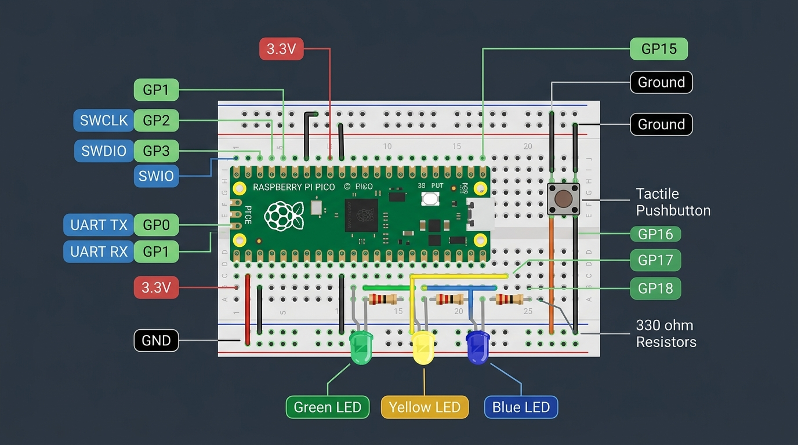
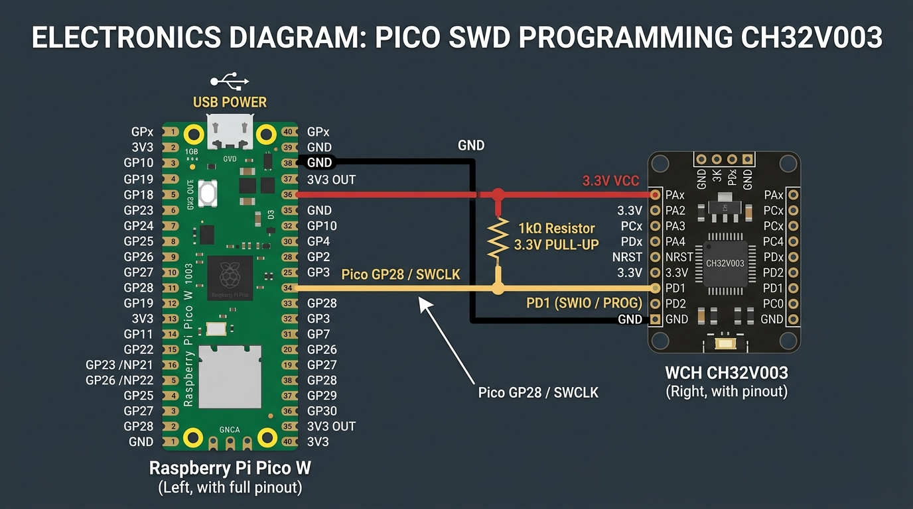
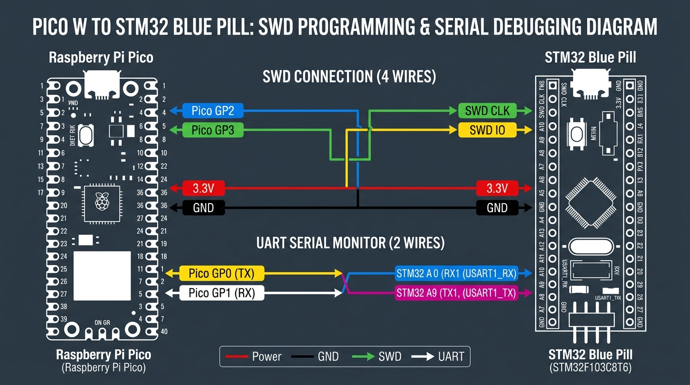

# Pico Universal Programmer & Multi-Debugger: Complete User Manual

This manual provides step-by-step instructions for assembling, wiring, and operating your **Pico Universal Programmer** directly from the **Arduino IDE** for all supported target boards.

---

## 1. Bill of Materials (BOM)

To assemble the complete hardware programmer on a breadboard, you will need:

| Component | Quantity | Description |
| :--- | :--- | :--- |
| **Raspberry Pi Pico** (RP2040) | 1 | The programmer brain (standard Pico or Pico H) |
| **Solderless Breadboard** | 1 | Standard half-size or full-size breadboard |
| **Tactile Pushbutton** | 1 | Mode selection button (6x6mm or similar) |
| **3mm or 5mm LEDs** | 3 | Status indicators: Green (DAP), Yellow (BMP), Blue (WCH) |
| **330Ω Resistors** | 3 | Current-limiting resistors for the status LEDs |
| **1kΩ Resistor** | 1 | **Mandatory** pull-up resistor for CH32V003 1-wire line |
| **Male-to-Male Jumper Wires** | ~10-15 | For breadboard and target connections |
| **Micro-USB Cable** | 1 | For connecting the Pico to your PC |

*(Note: The discrete LEDs and 330Ω resistors are optional; the Pico's onboard green LED on GP25 will also blink 1, 2, or 3 times to indicate the mode).*

---

## 2. Programmer Assembly & Breadboard Wiring

Here is the complete wiring diagram for assembling the programmer on your breadboard:

### Wiring Connections:

1. **Mode Button:**
   * One terminal of the pushbutton $\rightarrow$ **Pico Pin 20 (GP15)**.
   * Opposite terminal of the pushbutton $\rightarrow$ **Pico Pin 38 (GND)**.
   * *(Internal pull-up resistor is enabled in software; no external resistor needed for the button).*

2. **Status Indicator LEDs:**
   * **Green LED (Mode 1 - CMSIS-DAP):** Anode (long leg) to **Pico Pin 21 (GP16)**; Cathode (short leg) through a **330Ω resistor** to **GND**.
   * **Yellow LED (Mode 2 - Black Magic Probe):** Anode (long leg) to **Pico Pin 22 (GP17)**; Cathode (short leg) through a **330Ω resistor** to **GND**.
   * **Blue LED (Mode 3 - PicoRVD / WCH):** Anode (long leg) to **Pico Pin 24 (GP18)**; Cathode (short leg) through a **330Ω resistor** to **GND**.

3. **Power Rails:**
   * Connect **Pico Pin 36 (3V3 OUT)** to the breadboard **Red (+) rail**.
   * Connect **Pico Pin 38 (GND)** to the breadboard **Blue/Black (-) rail**.

---

## 3. Target Board Wiring Guides

---

### Target 1: WCH CH32V003 (1-Wire SWIO)

The CH32V003 uses a proprietary single-wire debug interface on pin **PD1**.

#### Wiring Table:

| Pico Pin | Pico Function | Target CH32V003 Pin | Notes |
| :--- | :--- | :--- | :--- |
| **Pin 34** | **GP28** | **Pin 8 (PD1 / SWIO)** | Single-wire data line |
| — | **1kΩ Resistor** | Between **3.3V** and **PD1** | **Mandatory pull-up resistor** |
| **Pin 36** | **3V3 OUT** | **Pin 2 (3.3V / VDD)** | Power target from Pico |
| **Pin 38** | **GND** | **Pin 7 (GND)** | Common ground connection |

> [!IMPORTANT]
> The **1kΩ pull-up resistor** between 3.3V and PD1 is mandatory. Without it, the 1-wire protocol cannot pull the signal high fast enough and communication will fail.

#### How to Program in Arduino IDE:
1. Tap the **Mode Button (GP15)** until the **Blue LED** is lit (or onboard LED blinks **3 times**).
2. In Arduino IDE:
   * **Tools > Board > CH32V EVT Boards** $\rightarrow$ **`CH32V003 EVT`**
   * **Tools > Port** $\rightarrow$ Select your Pico's **COM port**
   * **Tools > Programmer** $\rightarrow$ **`Pico Universal: PicoRVD (CH32V003 1-Wire SWIO)`**
3. Press **`Ctrl + Shift + U` (Upload Using Programmer)**.

---

### Target 2: STM32 (Blue Pill STM32F103 / Black Pill STM32F401/F411)

ARM Cortex-M chips use the standard 2-wire Serial Wire Debug (SWD) protocol.

#### Wiring Table:

| Pico Pin | Pico Function | Target STM32 Pin | Notes |
| :--- | :--- | :--- | :--- |
| **Pin 4** | **GP2** | **SWCLK** (Clock) | SWD Clock |
| **Pin 5** | **GP3** | **SWDIO** (Data) | SWD Data |
| **Pin 36**| **3V3 OUT** | **3.3V** | Power target from Pico |
| **Pin 8** | **GND** | **GND** | Common ground |
| **Pin 1** | **GP0 (TX)** | **PA10 (USART1 RX)** | Serial Monitor (Pico listens) |
| **Pin 2** | **GP1 (RX)** | **PA9 (USART1 TX)** | Serial Monitor (Pico transmits) |

#### How to Program in Arduino IDE:
1. Tap the **Mode Button (GP15)** until the **Green LED** is lit (or onboard LED blinks **1 time**).
2. In Arduino IDE:
   * **Tools > Board > STM32 boards groups** $\rightarrow$ Select your board (e.g. `Generic STM32F1 series`)
   * **Tools > Upload method** $\rightarrow$ **`OpenOCD`**
   * **Tools > Programmer** $\rightarrow$ **`Pico Universal: CMSIS-DAP (SWD)`**
3. Press **`Ctrl + Shift + U` (Upload Using Programmer)**.

---

### Target 3: Another Raspberry Pi Pico (Target RP2040)

To program and debug another Raspberry Pi Pico using your programmer:

| Pico Programmer Pin | Function | Target Pico Pin |
| :--- | :--- | :--- |
| **Pin 4 (GP2)** | **SWCLK** | Target **SWCLK** (3-pin debug header) |
| **Pin 5 (GP3)** | **SWDIO** | Target **SWDIO** (3-pin debug header) |
| **Pin 8 (GND)** | **GND**   | Target **GND** (3-pin debug header) |
| **Pin 1 (GP0)** | **UART TX** | Target **GP1 (UART0 RX)** |
| **Pin 2 (GP1)** | **UART RX** | Target **GP0 (UART0 TX)** |

#### How to Program in Arduino IDE:
1. Ensure the programmer is in **Mode 1** (**Green LED / 1 Blink**).
2. In Arduino IDE:
   * **Tools > Board > Raspberry Pi RP2040 Boards** $\rightarrow$ **`Raspberry Pi Pico`**
   * **Tools > Programmer** $\rightarrow$ **`Pico Universal: CMSIS-DAP (Picoprobe)`**
3. Press **`Ctrl + Shift + U`**.

---

### Target 4: Espressif ESP32 / ESP32-S3 (4-Wire JTAG)

Standard ESP32 microcontrollers support JTAG debugging:

| Pico Programmer Pin | Signal | ESP32 Target Pin | ESP32-S3 Target Pin |
| :--- | :--- | :--- | :--- |
| **Pin 4 (GP2)** | **TCK (Clock)** | GPIO 13 | GPIO 39 |
| **Pin 5 (GP3)** | **TMS (Mode)** | GPIO 14 | GPIO 42 |
| **Pin 6 (GP4)** | **TDI (Data In)** | GPIO 12 | GPIO 41 |
| **Pin 7 (GP5)** | **TDO (Data Out)**| GPIO 15 | GPIO 40 |
| **Pin 8 (GND)** | **GND** | GND | GND |

#### How to Program in Arduino IDE:
1. Mode 1 (**Green LED / 1 Blink**).
2. Select **Tools > Programmer > `CMSIS-DAP`**.
3. Press **`Ctrl + Shift + U`**.

---

## 4. Mode Operation Summary

| Mode | Indicator | Primary Target | Protocol Used |
| :--- | :--- | :--- | :--- |
| **Mode 1** | 🟢 **Green LED** (1 Blink) | STM32, RP2040, ESP32, WCH V203/307 | **CMSIS-DAP v2** (SWD & JTAG) |
| **Mode 2** | 🟡 **Yellow LED** (2 Blinks) | ARM & RISC-V direct GDB | **Black Magic Probe** (Built-in GDB) |
| **Mode 3** | 🔵 **Blue LED** (3 Blinks) | **WCH CH32V003** | **PicoRVD** (1-Wire SWIO on PD1) |

### Button Shortcuts:
* **Short Press (< 1s):** Cycles immediately to the next mode (`Mode 1 -> Mode 2 -> Mode 3 -> Mode 1`).
* **Long Press (> 2s):** Flashes all LEDs rapidly 5 times to confirm that the current mode is permanently saved into Flash memory as the default power-on mode.

---

## 5. Serial Monitor (UART) Debugging

The Pico programmer automatically provides a **USB-to-Serial converter** over the exact same USB cable:

* Connect Pico **GP0 (TX)** to Target **RX**.
* Connect Pico **GP1 (RX)** to Target **TX**.
* In Arduino IDE, open **Tools > Serial Monitor** (`Ctrl + Shift + M`).
* Any `Serial.println()` output from your target microcontroller will stream directly to your PC screen in real-time while you debug!

---

## 6. Electrical Safety & Rules of Thumb

> [!WARNING]
> **1. Voltage Warning (3.3V Logic):**
> * The Raspberry Pi Pico GPIOs are strictly **3.3V**.
> * Never connect 5V logic signals directly to the Pico. If you are working with an older 5V Arduino board (like Arduino Uno/Nano), you **must use a bidirectional logic level shifter**.
>
> **2. Common Ground:**
> * Always connect **GND** between the Pico and your target board, even if both boards are plugged into different USB ports.
>
> **3. 1kΩ Resistor on CH32V003:**
> * Never omit the 1kΩ pull-up resistor on the PD1 line when programming the CH32V003.
